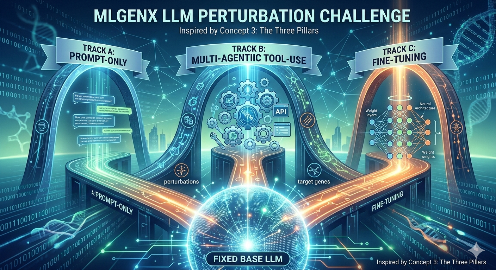

# BioReasoning Challenge — Track B Solution

**Competition:** [MLGenX BioReasoning Challenge @ ICLR 2026](https://www.kaggle.com/competitions/ml-gen-x-bioreasoning-challenge-track-b)  
**Task:** Predict gene expression changes from CRISPRi knockdowns in mouse macrophages  
**Track:** B — Agentic tool-use (fixed LLM: GPT-OSS-120B, tools allowed)

<p align="center">
  
</p>

---

## The Problem

Given a CRISPRi knockdown of gene `pert` in mouse bone marrow-derived macrophages (BMDMs), predict whether target gene `gene` is:

- **up** — significantly up-regulated
- **down** — significantly down-regulated  
- **none** — no significant change (55% of cases)

Evaluation metric: average of **DE AUROC** (differentially expressed vs. not) and **DIR AUROC** (direction — up vs. down among DE-positive rows).

---

## Our Approach

We built a DSPy-based agentic reasoning loop where the model iteratively queries biological databases before committing to a prediction.

### System Prompt (`prompt.txt`)

The model is instructed to reason like an expert immunologist:

1. **Classify the perturbation** — TF, kinase, chromatin remodeler, essential gene, etc.
2. **Check direct evidence** — TF→target edges, Perturb-seq data from K562 cells
3. **Check connectivity** — protein interaction partners, gene annotations
4. **Apply signalling logic** — TF KO → activation targets ↓, repression targets ↑
5. **Check global priors** — P(none) ≈ 0.55, P(up|DE) ≈ 0.69
6. **Submit graded probabilities** — continuous scores in [0,1], not hard 0/1

### Tools (6 total, in `tools/`)

| Tool | Data source | What it provides |
|------|-------------|-----------------|
| `gene_info` | [mygene.info](https://mygene.info) API | Gene summary, GO terms, pathways, gene type |
| `protein_interactions` | [STRING DB](https://string-db.org) API | PPI partners with confidence scores |
| `train_data_lookup` | Local `data/train.csv` | Known labels for related pert/gene pairs |
| `tf_target_edge` | Local GRN (BIOREASONDATA) | Direct TF→target regulatory edges |
| `perturb_seq_lookup` | Replogle et al. K562 Perturb-seq | Human K562 ortholog experimental data |
| `base_rates_and_examples` | Local `data/train.csv` | Global label priors + few-shot examples |

The model has a budget of **12 tool calls per question** with `reasoning_effort=medium`.

### Infrastructure

We ran inference on [LUMI](https://lumi-supercomputer.eu/) (Finland) using 8× AMD MI250X GPUs via [Ollama](https://ollama.com/) with `OLLAMA_NUM_PARALLEL=4`. The full 1,813-row test set takes ~6–8 hours. Results sync back to the local machine via Syncthing over an SSH tunnel.

---

## Repository Structure

```
BioReasoningChallenge/
├── track_b_submit.py       # Main inference script — DSPy ReAct agentic loop
├── prompts/                # System prompts + token counter
│   └── prompt.txt          # Expert macrophage immunologist (633 tokens)
├── tools/                  # 6 retrieval tools available to the agent
├── eval/                   # Local dev harness + official Kaggle metrics
├── slurm/                  # SLURM batch scripts for LUMI
├── scripts/                # One-time setup and utility scripts
├── mlgenx/                 # Challenge helper package (prompts, parsing)
├── data/                   # train.csv, test.csv, sample submissions
├── cache/                  # Pre-built lookup caches
├── docs/                   # Challenge images
└── outputs/                # Experiment runs — gitignored
    ├── track_a/
    ├── track_b/            # Each run → timestamped or SLURM job-ID subdir
    └── track_c/
```

Each folder has its own `README.md` with details.

---

## Setup

```bash
git clone <this-repo>
cd BioReasoningChallenge
uv sync
```

Set the data path (needed for TF→target edges; Perturb-seq falls back to `cache/`):

```bash
export BIOREASONDATA=/path/to/data    # directory containing a grn/ subdirectory
```

---

## Running Locally

Serve GPT-OSS-120B with vLLM (requires ~120 GB VRAM across GPUs):

```bash
uv sync --extra serve

vllm serve openai/gpt-oss-120b \
    --port 8000 \
    --enforce-eager \
    --no-enable-prefix-caching \
    --tensor-parallel-size 2    # adjust to your GPU count
```

Run predictions:

```bash
# Full test set (writes to outputs/track_b/YYYY-MM-DD_HHMMSS/)
uv run python track_b_submit.py \
    --api-base http://localhost:8000/v1 \
    --model    openai/gpt-oss-120b \
    --concurrency 16

# Quick 100-row evaluation against the training split
uv run python track_b_submit.py \
    --api-base http://localhost:8000/v1 \
    --model    openai/gpt-oss-120b \
    --eval-train --rows 100 --clear-cache
```

Each run creates a self-contained output directory:

```
outputs/track_b/2026-06-10_143022/
├── submission_track_b.zip     ← upload this to Kaggle
├── submission.csv
├── responses_cache.json       ← allows resuming interrupted runs
├── prompt.txt
└── tools/                     ← tool snapshots included in the zip
```

Resume an interrupted run by passing the same `--run-name`:

```bash
uv run python track_b_submit.py ... --run-name 2026-06-10_143022
```

Score a completed run locally:

```bash
uv run python eval/eval_harness.py \
    --cache outputs/track_b/2026-06-10_143022/responses_cache.json
```

---

## Running on LUMI

```bash
# First-time setup: sync code to LUMI and configure Syncthing
bash scripts/setup_syncthing_lumi.sh

# Submit full test run (8h, standard-g partition)
ssh lumi-uan01 "sbatch /scratch/project_465002610/sousapoz/code/slurm/run_track_b.sh"

# Check status
ssh lumi-uan01 "squeue -u sousapoz"
```

See `slurm/README.md` for all job scripts and `scripts/README.md` for the Syncthing setup.

---

## Submitting to Kaggle

Upload `outputs/track_b/<run_name>/submission_track_b.zip` to the [competition page](https://www.kaggle.com/competitions/ml-gen-x-bioreasoning-challenge-track-b/submissions).

---

## References

- Competition repo: [genentech/BioReasoningChallenge](https://github.com/genentech/bioreasoningchallenge)
- Data format: [PerturbQA](https://github.com/Genentech/PerturbQA) (Wu et al., ICLR 2025)
- Source data: CRISPRi Perturb-seq in mouse BMDMs
- Perturb-seq lookup: Replogle et al., Cell 2022 (K562 essential genes via Harmonizome)
